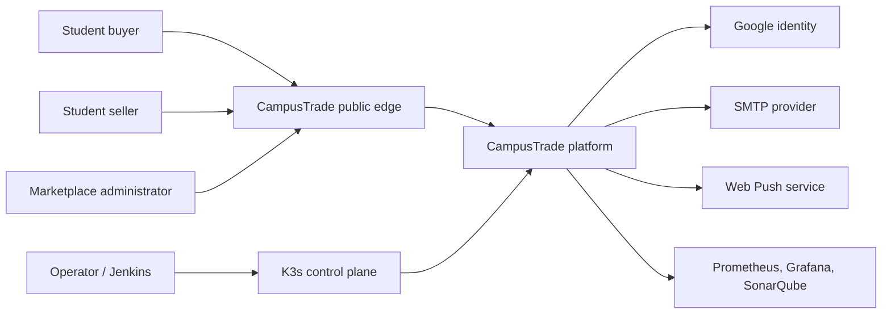
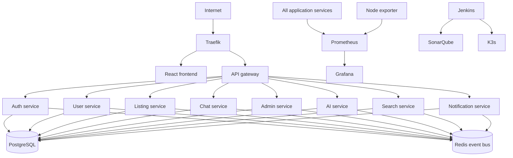
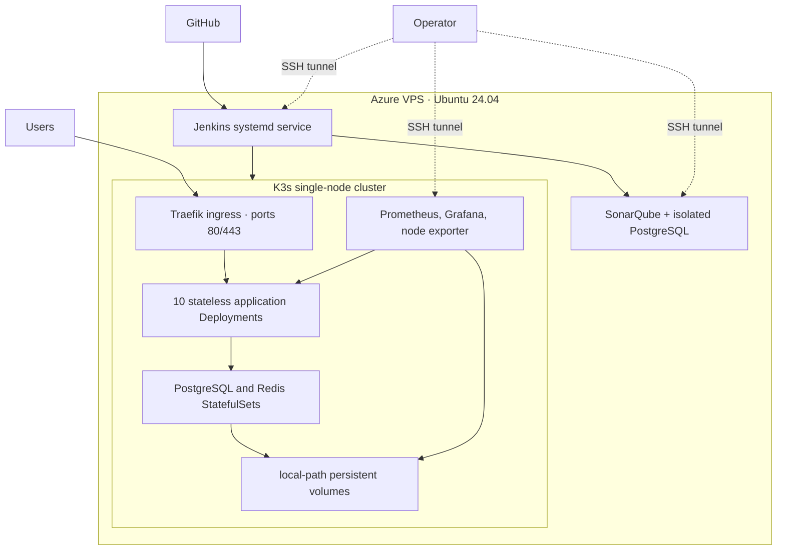

# CampusTrade software architecture

## Architectural drivers

CampusTrade is a campus-scoped marketplace whose most important qualities are
security, availability, evolvability, observability, and independent scaling.
Its design uses a microservice architecture for bounded business capabilities,
a layered structure inside each service, and event-driven collaboration through
Redis Pub/Sub.

## System context



## Container/component view



## Deployment view



## Module view

```text
campusmarket/
├── frontend/                 React presentation and client-side application
├── backend/
│   ├── services/             independently deployable bounded contexts
│   ├── shared/               event bus and observability utilities
│   ├── monitoring/           Prometheus rules and Grafana provisioning
│   └── scripts/              deployment, smoke, backup, and evidence automation
├── k8s/                      declarative runtime and network policies
├── ansible/                  VPS provisioning and platform deployment
├── docs/                     architecture, Scrum, testing, API, and user evidence
└── Jenkinsfile               delivery policy as code
```

## Key runtime flows

1. Synchronous requests enter through Traefik and the API gateway, which routes
   them to a bounded-context service using Kubernetes DNS.
2. Domain events such as listing creation, offers, fraud flags, and account
   changes are published through Redis and consumed asynchronously.
3. Each service writes only through parameterized queries to its logical schema
   in PostgreSQL.
4. Prometheus scrapes every service and the VPS; Grafana presents the operating
   view and alert rules identify availability, error-rate, latency, memory, and
   disk risks.
5. Jenkins builds immutable images, runs tests/security/quality gates, imports
   verified images into K3s, performs a rolling update, and rolls back on a
   failed readiness or smoke test.

## Quality attributes and tactics

| Attribute | Tactics |
|---|---|
| Availability | Liveness/readiness/startup probes, rolling updates, restart policies, PDBs, smoke tests, rollback |
| Scalability | Stateless services, Deployments, HPA-ready resource requests, service discovery, bounded contexts |
| Security | Least exposure, SSH-only administration, secrets outside Git, rate limits, Helmet, CORS allowlist, image/dependency scanning, network policies |
| Performance | Redis caching/events, indexed PostgreSQL data, independent service scaling, compressed static frontend |
| Observability | Correlated request IDs, `/health`, `/metrics`, Prometheus alerts, Grafana dashboards, Jenkins system reports |
| Modifiability | Small services, shared contracts/utilities, declarative infrastructure, independently replaceable adapters |
| Recoverability | Persistent volumes, pre-deploy PostgreSQL backups, idempotent schema initialization, versioned images, rollback scripts |

## Trade-offs

- Microservices improve independent deployment and conceptual boundaries, but
  add network, data-consistency, and operational complexity.
- Redis Pub/Sub reduces direct coupling and supports responsive workflows, but
  is not a durable message log; critical financial transitions remain in the
  database and future scale should adopt a durable broker.
- A single-node K3s cluster demonstrates full Kubernetes orchestration at low
  cost, but it does not survive VPS loss. Production growth should use a
  multi-node managed cluster and managed PostgreSQL/Redis.
- Shared PostgreSQL infrastructure is economical for an academic deployment,
  but independent service databases would provide stronger failure isolation.
- Local-path storage is simple and fast on one VPS, but backups and eventual
  migration to managed durable storage are mandatory.

## Advantages

- Clear service ownership and technology boundaries.
- Independent rollout and scaling of high-demand capabilities.
- Strong delivery automation and repeatable infrastructure.
- Rich application and platform telemetry.
- Innovation components can evolve without destabilizing core trading flows.

## Limitations

- Higher operational overhead than a modular monolith.
- Distributed failure modes and eventual consistency require careful UX.
- Single-node infrastructure remains a deliberate cost/availability compromise.
- Community SonarQube does not provide all enterprise branch-analysis features.

## Architectural design process

The team began with stakeholder goals and quality-attribute scenarios, divided
the domain into authentication, users, listings, chat/offers, administration,
AI/fraud, search, and notifications, then selected synchronous calls for direct
user responses and asynchronous events for cross-domain reactions. Deployment
and security tactics were evaluated against VPS capacity and examination
requirements. The final design retains the existing service boundaries while
replacing Compose application scheduling with Kubernetes and making delivery,
monitoring, rollback, and evidence generation explicit parts of the system.
