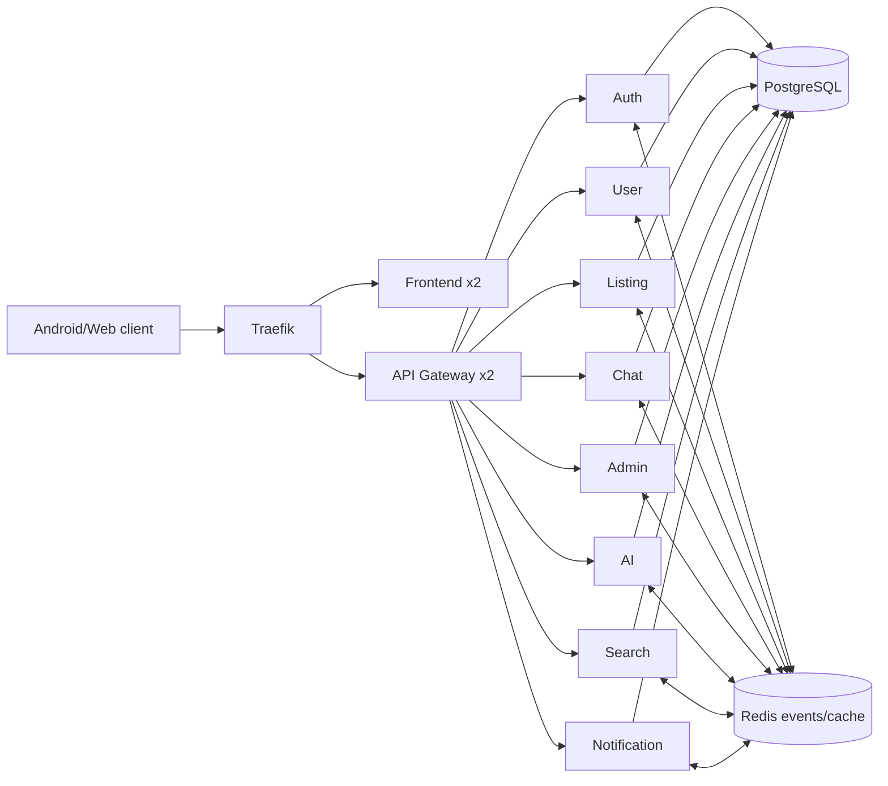

# CampusTrade: Architecture and Production Delivery of a Smart Campus Marketplace

**Software Architecture Project-Based Examination — Spring 2026**  
**Production system:** `http://4.168.192.5`  
**Repository:** `https://github.com/Nkinyampraises/smart-campus-market`

## Abstract

CampusTrade is a campus-focused marketplace that enables students to publish and discover listings, negotiate offers, communicate in real time, receive notifications, and report unsafe content. The project applies a microservice and event-driven architecture to separate nine backend capabilities behind an API gateway. This report describes requirements, Scrum delivery, architectural views, implementation, automated testing, VPS provisioning, container orchestration, continuous delivery, observability, code quality, results, trade-offs, and recommendations. The final production system runs on a single Azure VPS using K3s, PostgreSQL, Redis, Jenkins, Prometheus, Grafana, node-exporter, and SonarQube. The verified backend suite contains 306 tests and exceeds 80% aggregate coverage in statements, branches, functions, and lines.

## Chapter 1 — Introduction

### 1.1 Background

Campus communities continuously exchange textbooks, electronics, furniture, transport items, services, and other short-lived goods. General-purpose marketplaces can make these exchanges difficult because location, student trust, campus-specific discovery, and rapid negotiation are not first-class concepts. CampusTrade addresses this problem with a marketplace whose domain language includes campus zones, item condition, FCFA pricing, student profiles, wishlists, offers, conversations, notifications, moderation, and price/fraud assistance.

### 1.2 Problem statement

Students need a convenient marketplace that supports local discovery and safer negotiation while administrators need enough moderation and operational evidence to manage abuse. The technical challenge is to deliver those user journeys while demonstrating explicit software architecture, reproducible VPS deployment, automated CI/CD, Kubernetes orchestration, infrastructure automation, monitoring, code quality, and at least 80% test coverage.

### 1.3 Objectives

The project objectives were to:

1. Implement complete visitor, student, seller, buyer, and moderator journeys.
2. Separate domain capabilities into independently deployable services.
3. Protect user and administrative operations with validation, authentication, authorization, security headers, and rate limiting.
4. Provision and deploy the production system reproducibly on a VPS.
5. Automate build, test, audit, analysis, image creation, rollout, smoke testing, and evidence capture in Jenkins.
6. Provide Prometheus metrics, alert rules, Grafana dashboards, host metrics, and SonarQube quality analysis.
7. Produce architecture, testing, API, user, operations, Scrum, report, presentation, and demonstration deliverables.

### 1.4 Scope

The implemented scope includes registration and authentication, profiles, reviews, listing management, search and suggestions, wishlists, offers, real-time conversations, notifications, reports, moderation, fraud flags, price suggestions, trending listings, operational metrics, and deployment automation. A custom payment gateway, multi-region availability, and a second Kubernetes node are outside the examination environment.

## Chapter 2 — Literature review and Scrum process

### 2.1 Architectural foundations

The architecture combines four complementary ideas. A microservice decomposition isolates business capabilities. An API gateway provides a single HTTP boundary and cross-cutting controls. Redis pub/sub provides asynchronous domain-event communication for notifications, indexing, moderation, and AI-assisted checks. Container orchestration provides service discovery, declarative desired state, health probes, rolling updates, scaling objects, and persistent storage.

K3s was selected because it is conformant Kubernetes packaged for resource-constrained and edge environments while retaining core Kubernetes APIs. PostgreSQL provides relational constraints and transactional consistency for marketplace records. Redis supports short-lived caching and event distribution. Prometheus uses a pull model for application and host metrics; Grafana renders those metrics as operational dashboards. SonarQube centralises static analysis and coverage-aware quality policy. Jenkins represents the pipeline as versioned code.

### 2.2 Scrum process

Two sprints were organised around outcomes rather than technology layers. Sprint 1 delivered the usable marketplace foundation. Sprint 2 converted the system into a tested, reproducible, observable production deployment. Product Owner, Scrum Master, Developer, and Stakeholder accountabilities were explicitly assigned even where one student held multiple responsibilities. The product backlog, sprint backlogs, burndowns, reviews, retrospectives, and Definition of Done are recorded in `docs/scrum/SCRUM_EVIDENCE.md`.

The strongest retrospective action was the removal of test-only duplicate applications in the AI and search services. The corrected suites import the production servers, their routes, lifecycle functions, and event subscriptions. A second important learning occurred during cutover: readiness correctly stopped the deployment when a non-numeric container user and legacy `localhost` variables prevented service startup. The issue was diagnosed through Kubernetes events and logs, corrected declaratively, and retained as a CI validation lesson.

## Chapter 3 — Methodology

### 3.1 Requirements analysis

Functional requirements were captured as user outcomes: authenticate; manage a profile; publish, edit, sell, and remove listings; search and save listings; make and manage offers; chat; receive notifications; submit reports; moderate users/listings; and obtain automated price/fraud signals. Non-functional requirements included security, observability, maintainability, deployability, performance, availability during rolling updates, testability, traceability, and recoverability.

### 3.2 Architectural style and decomposition

The system uses an API-gateway microservice architecture with asynchronous event collaboration and a shared relational database. The gateway is the public backend boundary. The nine services are authentication, user, listing, chat, administration, AI assistance, search, notification, and gateway. Although the shared database reduces operational cost for a single-VPS examination deployment, schema ownership is kept logical and inter-service HTTP/event contracts remain explicit.

Detailed component, module, container, deployment, sequence, trust-boundary, quality-attribute, and trade-off views are provided in `docs/architecture/ARCHITECTURE.md`.

### 3.3 Data and algorithms

PostgreSQL stores users, listings, offers, conversations, messages, notifications, reports, fraud flags, search indexes, and transaction history. SQL parameters are passed separately from queries. Redis stores caches and carries domain events.

The price-suggestion algorithm aggregates comparable completed transactions by category and applies a condition factor. It returns a rounded suggested value, confidence, count, and a ±10% range. The fraud rules compare a listing against category history, floor prices, and recent seller activity; suspicious signals are events reviewed by administrators. Trending discovery combines listing views and recent wishlist activity with a weighted score, sorts descending, enriches seller identity, and caches the top results. PostgreSQL full-text vectors and `ts_rank` support marketplace search with allowlisted sort expressions.

### 3.4 Security methodology

Trust boundaries exist at browser-to-gateway HTTP, gateway-to-service HTTP, WebSocket connections, Redis events, database access, email/push providers, GitHub-to-Jenkins SCM, and operator access to administration tools. Controls include Helmet security headers, allowlisted CORS origins, global and route-specific rate limits, JWT verification, service-level authorization, input validation, parameterised SQL, generic production errors, request IDs, audit logging, non-root application containers, dropped Linux capabilities, Pod Security labels, encrypted Jenkins credentials, protected `.env` files, and loopback-only administrative listeners.

### 3.5 Test methodology

The repository runner executes Jest coverage for all nine backend services, aggregates raw counts rather than averaging percentages, writes HTML/JSON/LCOV output, and fails if any aggregate metric is below 80%. Tests cover route behavior, algorithms, authentication, authorization, hostile CORS, tampered tokens, rate limits, database failures, Redis failures, event handlers, push cleanup, metrics, health, and graceful shutdown. The complete strategy and service table are in `docs/testing/TEST_REPORT.md`.

### 3.6 VPS and infrastructure automation

The production VPS is Ubuntu 24.04 with 4 logical CPUs and 15 GiB RAM. Ansible playbook one installs prerequisites, configures kernel limits, creates the K3s administration group, grants Jenkins narrowly scoped K3s commands, creates protected production directories, verifies the K3s binary checksum, installs the systemd unit, and proves node readiness. Playbook two synchronises reviewed source, protects the environment, imports immutable images, applies Kubernetes, and reports status.

Kubernetes declares namespaces, ConfigMaps, Secrets, Services, Deployments, StatefulSets, PVCs, Ingresses, HPAs, PDBs, probes, requests, limits, and a node-exporter DaemonSet. The application namespace enforces baseline Pod Security. Host metrics and loopback host ports are isolated in a dedicated observability namespace with restricted audit warnings.

### 3.7 Continuous integration and delivery

The Jenkins pipeline checks out GitHub, publishes system information, validates Compose and Kustomize, lints/tests/audits the frontend, builds/tests/covers/audits the backend, runs SonarQube with a quality-gate wait, builds production images, scans each image for critical vulnerabilities with Trivy, imports immutable images into K3s, performs first-time migration or a rolling update, starts protected SonarQube services, captures evidence, archives reports, and cleans its workspace.

### 3.8 Data migration and rollback

The cutover was designed to keep the old Compose deployment authoritative until the new data layer was ready. It created a timestamped custom PostgreSQL dump, restored it into the Kubernetes PVC, stopped Compose without deleting volumes, rolled out applications, waited for Traefik, and ran smoke tests. A marker prevents future deployments from repeating the migration. The rollback script scales down Kubernetes applications and restarts the preserved Compose stack; both the dump and original volumes are retained.

## Chapter 4 — Results and discussion

### 4.1 Functional result

The public frontend and gateway are reachable at the production IP. Authentication, listings, search, wishlists, offers, conversations, notifications, public statistics, moderation, AI price suggestions, fraud checks, health, metrics, and hosted API documentation are implemented. A role-aware user manual is included in `docs/user/USER_MANUAL.md`.

### 4.2 Quality result

The backend contains 306 passing automated tests. Coverage is 92.49% statements, 80.14% branches, 80.30% functions, and 95.49% lines. This passes the fail-closed repository and Jenkins threshold. SonarQube Community 26.7 is `UP`; its default credential was replaced and the Jenkins analysis token is stored through the encrypted credential provider rather than source or pipeline text.

### 4.3 Deployment result

K3s v1.36.1 is Ready as the VPS control plane. Ten application deployments are available. The frontend and API gateway each maintain two replicas and have PDB/HPA resources. PostgreSQL and Redis run as StatefulSets with persistent claims. Traefik performs path-based service routing and Kubernetes DNS provides discovery.

### 4.4 Observability result

Prometheus is `UP` with 11 of 11 targets healthy: Prometheus itself, the gateway, eight domain services, and node-exporter. Grafana is `UP` with a provisioned data source and overview dashboard. Alerts cover service unavailability, error rate, latency, host CPU, memory, and disk pressure. Jenkins produces a dark system-information report with host CPU, memory, disk, Docker, K3s nodes/pods, build/commit identity, and status cards for Jenkins, Grafana, Prometheus, SonarQube, and scrape targets.

### 4.5 Innovation

CampusTrade adds domain-specific intelligence without making automation the final authority. Comparable-history price suggestions include a confidence level and price band. Fraud rules emit auditable signals for unusually low/high pricing and spam-rate behavior. Trending discovery blends views and wishlist intent. These features are integrated through events so listing publication is not tightly coupled to notification, indexing, or fraud workflows.

### 4.6 Trade-offs

Microservices increase process, deployment, and observability complexity but make capability boundaries and independent testing visible. A shared database is pragmatic on one VPS but does not offer full storage autonomy; future scale should evolve toward schema/database ownership. Redis pub/sub is fast and simple but not durable; critical workflows should move to a persistent broker or transactional outbox. Single-node K3s demonstrates orchestration and rolling updates but cannot survive full VM loss. Private administration upstreams reduce exposure while authenticated VPS TLS routes avoid workstation runtime dependencies.

### 4.7 Evidence

Machine-readable and human-readable evidence is retained at `/srv/campustrade/evidence/production-20260714`. It records Kubernetes resources, public API health, Prometheus targets, Grafana health, SonarQube status, and system information. The hosted API contract is available from `/api/docs/openapi.yaml`. Source evidence includes the Jenkinsfile, Ansible playbooks, Kubernetes manifests, monitoring configuration, coverage generator, and rollback scripts.

## Chapter 5 — Recommendations and conclusion

The next production increment should attach a domain, automate TLS with cert-manager, place an authenticated ingress or VPN in front of administration tools, store protected values in a managed secret service, and add external backups with a restore drill. A second or third Kubernetes node would turn PDBs and replica counts into host-failure tolerance; a durable message broker or transactional outbox would protect critical events. Database-per-service ownership can then be introduced only where scaling or organisational autonomy justifies its cost.

CampusTrade meets the examination objectives through a working campus marketplace, explicit architectural views and trade-offs, two-sprint Scrum evidence, Ansible automation, a Jenkins CI/CD pipeline, K3s orchestration, Prometheus/Grafana monitoring, SonarQube analysis, hosted OpenAPI documentation, more than 80% coverage, and a production VPS deployment with retained evidence and rollback. The controlled cutover failure is itself valuable evidence: health gates prevented a false success, diagnosis used observable production signals, and the final declarative fix left the platform healthier and repeatable.

## References

1. Kubernetes Documentation. “Concepts: Workloads, Services, Storage, and Configuration.” https://kubernetes.io/docs/concepts/
2. K3s Documentation. “Lightweight Kubernetes.” https://docs.k3s.io/
3. Prometheus Documentation. “Overview and Configuration.” https://prometheus.io/docs/
4. Grafana Documentation. “Dashboards and Provisioning.” https://grafana.com/docs/grafana/latest/
5. Jenkins Documentation. “Pipeline.” https://www.jenkins.io/doc/book/pipeline/
6. SonarSource Documentation. “SonarQube Server.” https://docs.sonarsource.com/sonarqube-server/
7. OWASP Foundation. “OWASP Top 10: 2021.” https://owasp.org/Top10/
8. Fielding, R. “Architectural Styles and the Design of Network-based Software Architectures.” University of California, Irvine, 2000.
9. Newman, S. *Building Microservices*, 2nd ed. O’Reilly Media, 2021.
10. Schwaber, K. and Sutherland, J. “The Scrum Guide,” 2020. https://scrumguides.org/
